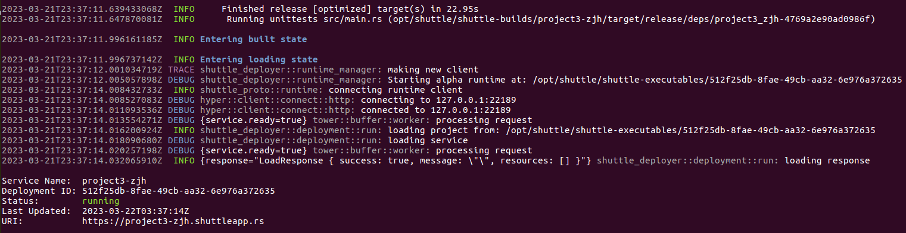

# Jinghuai Zhang-Microservice-Project3: CNTranslator (Chinese Translator)

## Key Objective of the Project 3: Serverless Data Engineering Pipeline

In this project, we are asked to build a serverless data engineering pipeline. In particular, I use the shuttle.rs, a Rust based tool, to simplify the deployment of my Rust based service (CNTranslator) to AWS Lambda. As for my service, I build the CNTranslator (Chinese Translator) with the help of the Chinese dictionary-API to achieve a powerful functions: Given an arbitrary English phrase, the program can translate it into Chinese.

### Setup Shuttle

* Login Shuttle.rs via this link: https://www.shuttle.rs/login

* Install shuttle via this command `cargo install cargo-shuttle`

* Start the login process via this command `cargo shuttle login`

* Enter the user-specifc api-key in the terminal (e.g., 7gTAkivjRLBcDSRv)

* Initialize the project via this command `cargo shuttle init`

* Deploy the project via this command `cargo shuttle deploy --allow-dirty`

### Test the project locally.

* To run the project, type:

`cargo shuttle run` 

* Usage of an example:

Url "http://127.0.0.1:8000/query/\<English\ phrase\>" translates an input English phrase into Chinese.

### Deploy the project using Shuttle

* To deploy the project, type:

`cargo shuttle deploy --allow-dirty`

* The service will be available at <your project name>.shuttleapp.rs. For example:

* Then, you can feel free to use your service via this terminal command ``curl -k https://project3-zjh.shuttleapp.rs/query/<English phrase>``

Note: we need `-k` to bypass the ssl certification.

