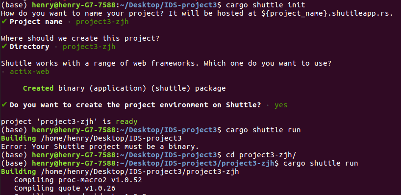
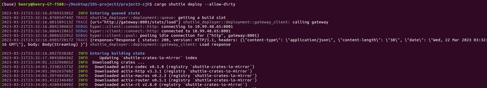

# Jinghuai Zhang-Microservice-Project3: CNTranslator (Chinese Translator)

## Key Objectives of the Project 3
Build a functional web microservice or CLI in data engineering or machine learning engineering that uses a large data platform, which include Apache Spark, Google BigQuery, Microsoft Azure HDInsight, and Amazon EMR (Elastic MapReduce). These platforms are designed to handle large volumes of data, provide scalable processing and storage, and support distributed computing. They also often have built-in features for data analysis, data visualization, and machine learning.

In this project, I build a Chinese Translator named CNTranslator with the help of the Chinese dictionary-API to achieve two powerful functions: (a) Given an arbitrary English phrase, the program can translate it into Chinese. (b) Given an arbitrary Chinese sentence or phrase, the program can segment it into several meaningful pieces.

### Test the project locally.

* To run the project, type:

`cargo run` 

* Usage of an example:

Url "0.0.0.0:8080" returns the root page of our CNTranslator: "Hi! You can use our CNTranslator via following URL queries: (a) Translate an English phrase into Chinese via query/<xxx> (b) Segment a Chinese sentence via seg/<xxx>."

Url "0.0.0.0:8080/query/<English phrase>" translates an input English phrase into Chinese.

Url "0.0.0.0:8080/seg/<Chinese sentence>" segments an input Chinese sentence into meaningful pieces.

